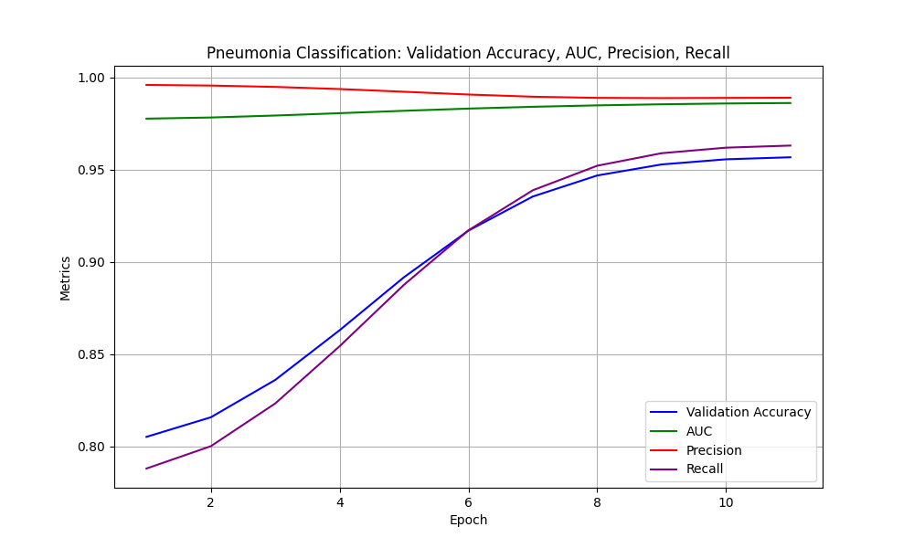

Lung Pneumonia Classification: Accuracy 97%

This repository contains a comprehensive pipeline for performing lung segmentation and disease classification using convolutional neural networks (CNNs). The project is divided into several stages, including preprocessing, U-Net segmentation training, classification training, and testing.

---

## **1. Preprocessing**
The preprocessing stage handles the preparation of the datasets for segmentation and classification tasks.

### **Datasets**
- **Lung Segmentation Dataset**: Used to train the U-Net model for lung segmentation.
- **Chest X-ray Pneumonia Dataset**: Used to train the classifier for detecting diseases (e.g., pneumonia).

### **Command**
Run preprocessing with:
```bash
python preprocess.py
```

---

## **2. U-Net Segmentation Training**
The U-Net model is trained to segment lungs from chest X-ray images.

### **Command**
Train the U-Net model with:
```bash
python train_mask.py
```

---

## **3. Classification Training**
The classification model uses the U-Net segmentation output and the original chest X-ray to classify images as `NORMAL` or `PNEUMONIA`.


### **Command**
Train the classifier with:
```bash
python train_cls.py
```

---

## **4. End-to-End Training Pipeline**
To train both U-Net and classifier models in a single script, use:

### **Command**
Run the end-to-end training pipeline with:
```bash
python train.py
```

---

## **5. Testing**
The testing phase evaluates the performance of the U-Net model by overlaying predicted masks onto original images.

### **Script**
`test.py`


### **Command**
Test the U-Net model with:
```bash
python test.py
```

---

## **6. Evaluation**

### **Metrics**
- **Segmentation**: IoU, Dice Coefficient, Pixel Accuracy, Precision, Recall, Specificity
- **Classification**: Accuracy, AUC, Precision, Recall.

These metrics are logged during training and saved to CSV files for analysis.




---

## **File Structure**
```
.
├── datasets/                     # Preprocessed datasets
├── output/                       # Saved models and training logs
├── preprocess.py                 # Preprocessing script
├── train_mask.py                 # U-Net training script
├── train_cls.py                  # Classifier training script
├── train.py                      # Combined training pipeline
├── test.py                       # Testing script for U-Net
├── tools/
│   ├── model.py                  # Model definitions (U-Net, Classifier)
│   ├── eval_util.py              # Evaluation metrics
│   ├── record.py                 # Logging utilities
```

---

## **Dependencies**
Install required dependencies using:
```bash
pip install -r requirements.txt
```

---

## **Results**
1. **U-Net Segmentation**:
    - Visualize segmentation results with `test.py`.
2. **Classification**:
    - Analyze metrics like accuracy, AUC, and loss from logs in `output/training_log.csv`.

---

For further assistance, feel free to raise an issue or reach out to the maintainers!

